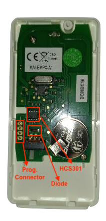
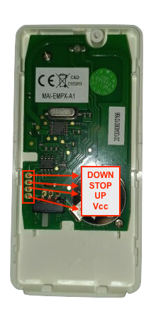
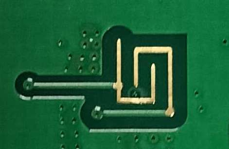
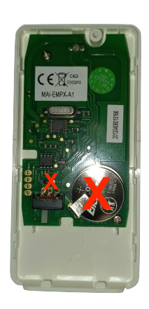
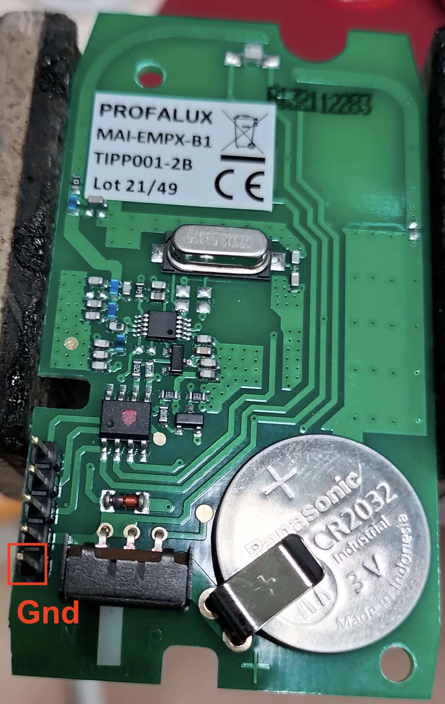
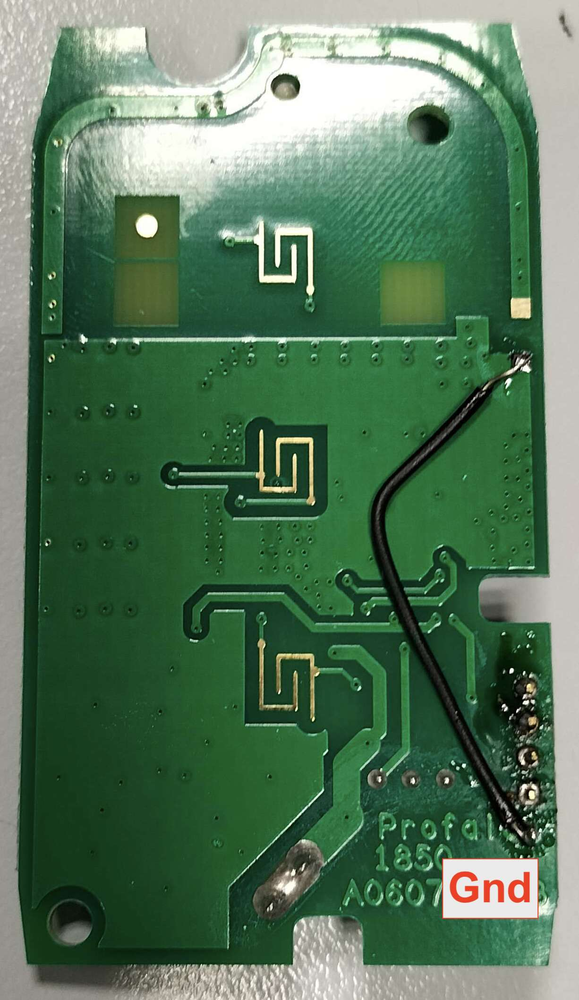
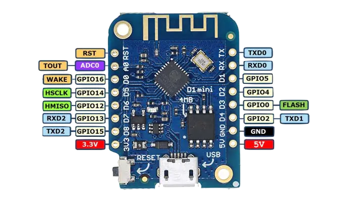

# Profalux 868MHz (not _ZigBee_) roller shutter integration to EspHome/HA

> This project has been made with the help of [Tam](https://github.com/TamGit) and [Gérard/F6EEQ](https://github.com/F6EEQ).

<a href= "img/EMPX-B1.jpg">

</a>
&nbsp;
<br/><br/><br/><br/>

Prior to Zigbee adoption, Profalux roller shutter / remote communications were relying on a 868MHz protocol using [rolling codes](https://en.wikipedia.org/wiki/Rolling_code).

The most common remote, usually shipped with roller shutter, is a 3 buttons `MAI-EMPX-B1` model.

Such shutters can be controlled by several remotes, each remote can be paired to several shutters. See this document (in french) for [pairing a new remote](https://static.1001telecommandes.com/documents/1001-notice-profalux-empxb1.pdf) to an already paired couple of roller shutter / remote.

<br/><br/>


With the help of a [*Flipper Zero*](https://docs.flipper.net), each of the 3 commands sent by the remote to the shutter when pressing `up` / `down` / `stop` can be easily captured but replaying these commands is also not an option since commands contain rolling codes protecting shutters from replay attacks.

**So, the best option remains to emulate button press with a micro-controller connected to the remote.**

To get *Home Assitant* being able to control roller shutters, remote integration to *EspHome / HA* is performed through 2 main steps:

- **connect the remote to an ESP8266** micro-controller to emulate button press actions
- **setting up an EspHome device** exposing buttons, and integrate it to HA if needed.
<br/><br/>

> N.B. the idea is also to keep remote **as usable as before as possible**, meaning that **buttons could still be pressed by someone real** ;-)

The following gives details about the journey.

## A few words about the remote

<a href= "img/EMPX-B1-board.png">

</a>
</br></br></br></br>
&nbsp;

`MAI-EMPX-B1` remote is  built around a 868 MHz RF emitter and a [HCS301](https://ww1.microchip.com/downloads/en/devicedoc/21143b.pdf) rolling code / modulator chip. The HCS301 chip can handle up to 4 buttons, only 3 are used here.

&nbsp;
A **(unsoldered) 4 point connector** is accessible in order to program the HCS301 chip (store keys used for *KEELOQ*, ...)

&nbsp;
A **diode** protect the battery against receiving current from the outside through programming connector.

</br></br></br></br></br>

> By the way, **in order not to destroy any existing remote**, it s a good idea to search for a **spare one**. A brand new remote costs more or less 70 Euros but refurbished can be found for half that price.


## Step 1: Figuring things out 

<a href= "img/EMPX-B1-board-figuredOut.png">

</a>
&nbsp;
<br/><br/><br/><br/><br/><br/>
The wiring of the connector can easily be reversed by testing connections with HCS301 chip as well as with buttons pads on the back side. 
<br/><br/>
<a href= "img/EMPX-Back.jpg.jpg">

</a>
<br/><br/>

**Pressing a button pulls input state to Vcc.**

<br/><br/><br/><br/><br/><br/><br/>

<a href= "img/EMPX-B1-board-figuredOut2.png">

</a>
&nbsp;
<br/><br/><br/><br/><br/<br/><br/><br/>

As the remote will be connected to a USB-powered ESP board, the **battery is no longer needed**. 
<br/>

**Removing the battery however requires to shunt the protection diode. If not, RF emitter won't be supplied with power.**
<br/><br/><br/><br/><br/><br/><br/><br/>


## Step 2: pressing remote buttons using a micro-controller.


### Soldering a connector with `GND` pin

In order to connect the remote to the ESP, `GND` pin has to be provided.

This can be done simply by: 

- **drilling a fifth connector hole** besides `Vcc` 
- **soldering a 5 pin male header** on the connector pads
- **soldering** `Gnd` pin to a **ground location elsewhere**


<a href= "img/Profalux-Front-after.jpg">

</a>


<a href= "img/Profalux-Back-after.jpg">

</a>

### Connecting the ESP

<a href= "img/d1-mini-pinout.png">

</a>

The ESP used is an ESP8266-based [`Wemos D1 mini V3.0`](https://www.randomdiyprojects.it/wemos-d1-mini-v3-0-0/)

**Wiring** is the following:


| D1 mini side | Remote side |
|:------------:|:-----------:|
|    `D6`      |    `Down`   |
|    `D7`      |    `Stop`   |
|    `D8`      |    `Up`     |
|    `3.3V`    |    `Vcc`    |
|    `GND `    |     `GND`   |


### PoC Arduino sketch

The following [Arduino sketch](./Profalux2Esphome.ino) can be used to check if button press are properly emulated by the ESP: 

- by pairing the remote with the shutter and see if it rolls,
- by capturing traffic with a Flipper Zero (`Sub-GhZ` ->  `read`  / with scanning frequency set on `868MHz`).


> To get the D1 board working with Arduino IDE, refer to the [official documentation](https://www.wemos.cc/en/latest/tutorials/d1/get_started_with_arduino_d1.html).


```c
#define DOWN D6
#define STOP D7
#define UP D8

#define PULSE_DELAY 500
#define WAIT_DELAY 10000

void setup() {
  pinMode(UP, OUTPUT);
  pinMode(STOP, OUTPUT);
  pinMode(DOWN, OUTPUT);
  Serial.begin(9600);
}

void pressButtonAndWait(int pin) {
  Serial.println("DOWN");
  delay(10000);
  digitalWrite(DOWN, HIGH);
  delay(500);
  digitalWrite(DOWN, LOW);
}

void loop() {
  Serial.println("DOWN");
  pressButtonAndWait(DOWN);
  Serial.println("STOP");
  pressButtonAndWait(STOP);
  Serial.println("UP");
  pressButtonAndWait(UP);
}
```

## Step 3: make it the EspHome/HA way

> To get the D1 board running EspHome firmware, refer to `Getting started` section of the [official documentation](https://esphome.io).

### Configuration 1: easy but with cons

Configuring the EspHome device is pretty straightforward, as buttons can be considered as [momentary swicthes](https://esphome.io/components/switch/gpio.html).

The **cons are nevertheless that physically pressing buttons will no longer work** because since GPIO pins are configured as `OUTPUT`, `LOW` (switch `OFF` state) state pulls pin to `GND` while pressing button pulls pin to `Vcc`.


The resulting [configuration file](./Profalux2Esphome-withoutButtons.yaml) (only relevant sections are shown) is below:

```yaml
esphome:
  name: profalux2esphome

esp8266:
  board: d1_mini_lite

# (missing elements like wifi, ... should be inserted here)
# ...
#

switch:
  - platform: gpio	
    pin: D6
    id: down
    name: "Down"
    on_turn_on:
    - delay: 500ms
    - switch.turn_off: down
    restore_mode: ALWAYS_OFF 
  - platform: gpio
    pin: D7
    id: stop
    name: "Stop"
    on_turn_on:
    - delay: 500ms
    - switch.turn_off: stop
    restore_mode: ALWAYS_OFF 
  - platform: gpio
    pin: D8
    id: up
    name: "Up"
    on_turn_on:
    - delay: 500ms
    - switch.turn_off: up
    restore_mode: ALWAYS_OFF 
  

web_server:
  port: 80

```

> `web_server` section is useful only when using EspHome without HA, to be able to toogle buttons through device dashboard.

### Configuration 2: make button pressable again

In order to bring back physical buttons to life, GPIO pin mode has to be changed to `INPUT` when switch is in `OFF` state.

The resulting [configuration file](./Profalux2Esphome-withButtons.yaml) (only relevant sections are shown) is below:

```yaml
esphome:
  name: profalux2esphome

esp8266:
  board: d1_mini_lite

# (missing elements like wifi, ... here)
...
#

substitutions:
  down_pin: 'D6'
  stop_pin: 'D7'
  up_pin: 'D8'

output:
  - platform: gpio
    pin: ${down_pin}
    id: gpio_down
  - platform: gpio
    pin: ${stop_pin}
    id: gpio_stop
  - platform: gpio
    pin: ${up_pin}
    id: gpio_up

switch:
  - platform: output
    output: gpio_down
    id: down
    name: "Down"
    on_turn_on:     
    - lambda: |-
        pinMode(${down_pin}, OUTPUT);
        digitalWrite(${down_pin}, HIGH);     
    - delay: 500ms
    - switch.turn_off: down
    on_turn_off:     
    - lambda: |-
        pinMode(${down_pin}, INPUT);       
    restore_mode: ALWAYS_OFF 

  - platform: output
    output: gpio_stop
    id: stop
    name: "Stop"
    on_turn_on:     
    - lambda: |-
        pinMode(${stop_pin}, OUTPUT);
        digitalWrite(${stop_pin}, HIGH);     
    - delay: 500ms
    - switch.turn_off: stop
    on_turn_off:     
    - lambda: |-
        pinMode(${stop_pin}, INPUT);       
    restore_mode: ALWAYS_OFF 
  
  - platform: output
    output: gpio_up
    id: up
    name: "Up"
    on_turn_on:     
    - lambda: |-
        pinMode(${up_pin}, OUTPUT);
        digitalWrite(${up_pin}, HIGH);     
    - delay: 500ms
    - switch.turn_off: up
    on_turn_off:     
    - lambda: |-
        pinMode(${up_pin}, INPUT);       
    restore_mode: ALWAYS_OFF 
  
```

Job done! <br/> [S.](https://github.com/sebastienjean)


